<!--
  Generated terminal profile layout.
  Art: assets/*.svg  ·  Config: config/profile.yaml  ·  Scripts: scripts/
-->

  <code>vedant@github:~$ neofetch</code>

  
  

  <code>vedant@github:~$ git log --since=1.year --oneline | wc -l</code>

  

  <a href="https://vedantambre.vercel.app">website</a>
  ·
  <a href="https://linkedin.com/in/vedantambre">linkedin</a>
  ·
  <a href="mailto:ambreved3@gmail.com">email</a>

